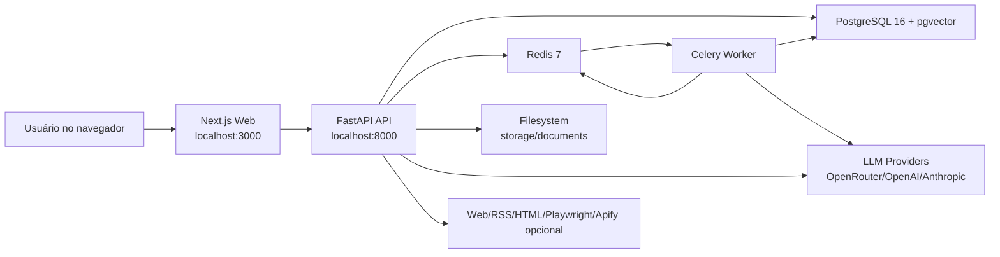
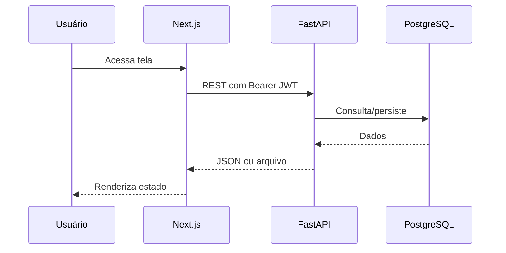
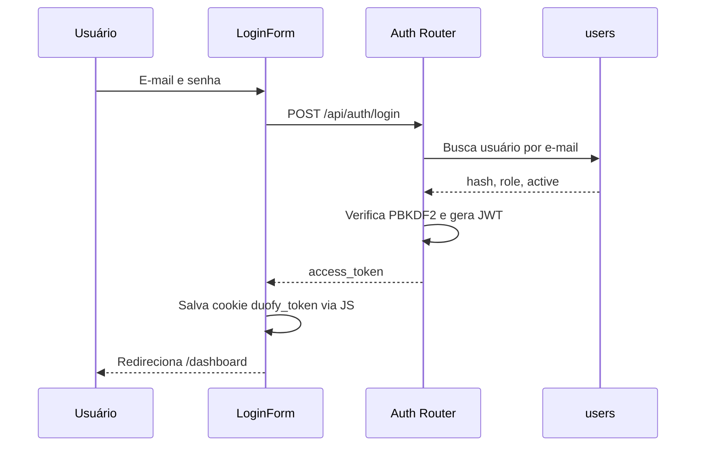
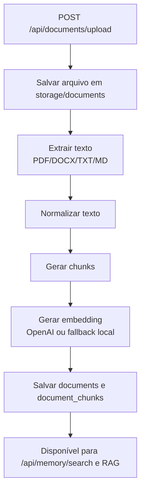
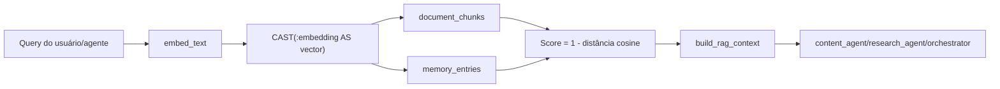
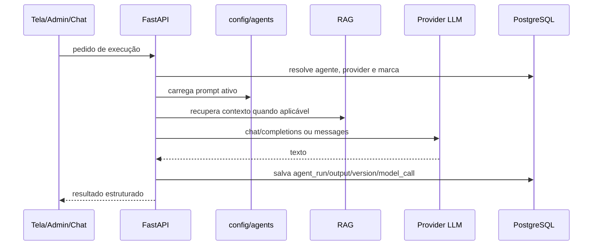
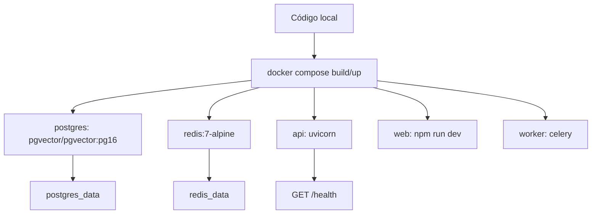
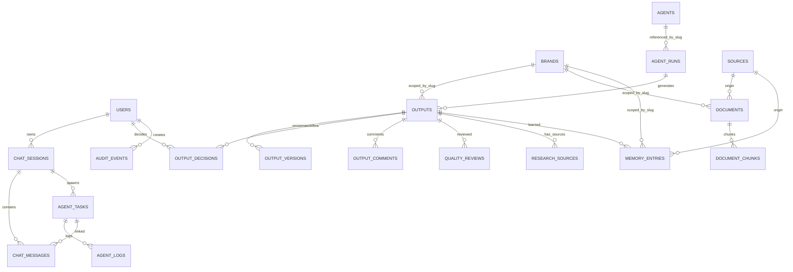

# Mapa Técnico e Operacional do DUOFY V1

Documento gerado em 2026-06-25 a partir de inspeção direta do repositório `C:\DUOFY_V1_MARKETING_AI`, do arquivo `docs/ESTADO_ATUAL_DO_SISTEMA.md`, dos arquivos de código/configuração/migrations, dos containers Docker em execução e do banco PostgreSQL local. Este documento descreve implementação real observável. Intenções em prompts, README ou planos anteriores só são tratadas como realidade quando há código, schema, endpoint, tela ou dado executável que comprove.

Nenhum segredo foi incluído. Quando o banco indicou presença de chave configurada, o documento registra apenas `has_key=true`, sem expor valor.

## 1. Stack tecnológica

| Camada | Tecnologia e versão validada | Onde é utilizada | Evidência | Status |
|---|---|---|---|---|
| Monorepo | npm workspaces | Organização do frontend dentro de `apps/web`. | `package.json` | FUNCIONAL |
| Frontend | Next.js `14.2.35`, React `18.3.1`, TypeScript `^5`, Tailwind `^3.4.17` | App Router, telas internas, workspace editorial. | `apps/web/package.json`, `apps/web/app`, `apps/web/components` | FUNCIONAL |
| Node local | Node `22.18.0`, npm `10.9.3` | Execução local fora do container. | comando `node --version`, `npm --version` | NÃO VALIDADO em produção |
| Node container | Node `20.20.2`, npm `10.8.2` | Container `duofy-web`. | `apps/web/Dockerfile`, `docker compose exec web node --version` | FUNCIONAL |
| Backend | Python container `3.11.15`, FastAPI `0.138.0`, Uvicorn `0.49.0` | API REST e lifespan do scheduler. | `apps/api/Dockerfile`, `apps/api/app/main.py`, comando no container | FUNCIONAL |
| Python local | Python `3.12.10` | Execução de testes/comandos locais. | `python --version` | FUNCIONAL para desenvolvimento |
| ORM/migrations | SQLAlchemy `2.0.51`, Alembic `>=1.14,<2` | Modelos e evolução de schema. | `apps/api/app/models.py`, `apps/api/alembic/versions`, `apps/api/requirements.txt` | FUNCIONAL |
| Banco relacional | PostgreSQL `16.14` | Persistência principal. | `docker-compose.yml`, comando `select version()` | FUNCIONAL |
| Banco vetorial | pgvector `0.8.2`, extensão `vector` | Embeddings em `document_chunks` e `memory_entries`. | `infra/postgres/init/001_enable_pgvector.sql`, `apps/api/app/models.py`, `select extversion` | FUNCIONAL |
| Cache/fila | Redis server `7.4.9`, redis-py `5.3.1` | Celery broker/backend e lock do scheduler. | `docker-compose.yml`, `apps/api/app/worker.py`, `apps/api/app/calendar_scheduler.py` | FUNCIONAL |
| Worker async | Celery `5.6.3` | Processamento de tarefas do chat. | `apps/api/app/worker.py`, serviço `worker` no Compose | FUNCIONAL |
| Auth | JWT com PyJWT, PBKDF2 local | Login e proteção por Bearer token. | `apps/api/app/security.py`, `apps/api/app/routers/auth.py`, `apps/web/lib/auth.ts` | PARCIAL |
| Armazenamento de arquivos | Filesystem local `storage/documents` | Upload/download/export de documentos. | `apps/api/app/routers/documents.py` | PARCIAL |
| LLM providers | OpenRouter, OpenAI, Anthropic via `provider_credentials` | Execução de agentes. | `apps/api/app/llm.py`, `apps/api/app/routers/admin.py` | PARCIAL |
| Provider ativo no banco | OpenRouter habilitado, `has_key=true`, modelo `~anthropic/claude-sonnet-latest` | Geração de conteúdo, pesquisa e agentes. | consulta `provider_credentials` | FUNCIONAL |
| Embeddings | OpenAI embeddings configurável; fallback local determinístico | Indexação e busca RAG. | `apps/api/app/embeddings.py` | PARCIAL |
| Pesquisa externa | RSS/feedparser, httpx, BeautifulSoup, trafilatura, Playwright Chromium, Apify opcional | Coleta de fontes para pesquisa. | `apps/api/requirements.txt`, `apps/api/Dockerfile`, `apps/api/app/research_service.py` | PARCIAL |
| Exportação de documentos | ReportLab PDF, python-docx, HTML/MD próprios | Outputs, reports e documentos. | `apps/api/app/export_service.py`, `apps/api/app/routers/outputs.py`, `documents.py`, `reports.py` | FUNCIONAL |
| Testes backend | pytest `>=8.3,<9`, ruff `>=0.8,<1` | Testes unitários e lint Python. | `apps/api/pyproject.toml`, `apps/api/tests` | PARCIAL |
| Lint/build frontend | `next lint`, `next build` | Validação web. | `apps/web/package.json` | FUNCIONAL |
| Infra local | Docker `29.5.3`, Docker Compose `5.1.4` | API, Web, Worker, Postgres, Redis. | `docker-compose.yml`, comandos Docker | FUNCIONAL |
| Deploy produção | Não há configuração de produção completa | O Compose roda o web em modo `npm run dev`. | `apps/web/Dockerfile` | NÃO IMPLEMENTADO |
| Observabilidade | Tabelas `model_calls`, `audit_events`, endpoints `/api/operations/*` | Uso, custo estimado, qualidade e auditoria. | `apps/api/app/operations_service.py`, `apps/api/app/routers/operations.py` | PARCIAL |

Notas verificadas:

- O container web está em `node:20-alpine`, mas o host usa Node 22. Evidência: `apps/web/Dockerfile` e comandos de versão.
- O container API usa Python 3.11, enquanto o host usa Python 3.12. Evidência: `apps/api/Dockerfile` e comandos de versão.
- O banco local está no head Alembic `0014_audit_events`. Evidência: consulta `select version_num from alembic_version`.
- O frontend Dockerfile instala dependências e executa `npm run dev`; isso é adequado para desenvolvimento, não para produção. Evidência: `apps/web/Dockerfile`.

## 2. Arquitetura

### 2.1 Visão geral

O sistema é um monorepo local-first com frontend Next.js, backend FastAPI, PostgreSQL + pgvector, Redis e worker Celery. A maior parte dos fluxos síncronos passa pelo FastAPI. O chat cria tarefas assíncronas que o worker processa via Redis. O scheduler de calendário roda dentro do lifespan da API e usa Redis como lock.

Evidências principais: `docker-compose.yml`, `apps/api/app/main.py`, `apps/api/app/worker.py`, `apps/api/app/calendar_scheduler.py`, `apps/web/lib/api.ts`.



### 2.2 Comunicação frontend/backend

- O frontend chama a API por `NEXT_PUBLIC_API_URL`, padrão `http://localhost:8000`. Evidência: `.env.example`, `docker-compose.yml`, `apps/web/lib/api.ts`.
- O token JWT é enviado em `Authorization: Bearer`. Evidência: `apps/web/lib/api.ts`.
- O cookie `duofy_token` é manipulado no cliente por JavaScript. Evidência: `apps/web/lib/auth.ts`.
- Não há GraphQL; todas as integrações observadas são REST.



### 2.3 Síncrono, assíncrono, SSE e polling

| Mecanismo | Implementação | Evidência | Status |
|---|---|---|---|
| REST síncrono | Conteúdo, pesquisa, documentos, aprovações, admin, métricas. | `apps/api/app/routers/*.py` | FUNCIONAL |
| Celery assíncrono | Tarefas do chat. | `apps/api/app/worker.py`, `apps/api/app/task_service.py`, `apps/api/app/routers/chat.py` | FUNCIONAL |
| SSE | Stream de status da tarefa em `/api/tasks/{task_id}/stream`. | `apps/api/app/routers/tasks.py` | FUNCIONAL |
| WebSocket | Não encontrado. | ausência de routers WebSocket | NÃO IMPLEMENTADO |
| Polling frontend | Algumas telas recarregam via chamadas manuais/client-side. | `apps/web/app/(app)/*/page.tsx` | PARCIAL |

### 2.4 Fluxo de autenticação



Limitações: sem refresh token, sem revogação, sem cookie HttpOnly, sem CSRF formal e sem escopo por workspace. Evidências: `apps/api/app/routers/auth.py`, `apps/api/app/security.py`, `apps/web/lib/auth.ts`, `apps/web/middleware.ts`.

### 2.5 Ingestão de documentos



Evidências: `apps/api/app/routers/documents.py`, `apps/api/app/document_processing.py`, `apps/api/app/embeddings.py`, `apps/api/app/rag.py`.

### 2.6 RAG



Evidências: `apps/api/app/rag.py`, `apps/api/app/embeddings.py`, `apps/api/app/orchestrator.py`, `apps/api/app/content_generation.py`.

### 2.7 Fluxo de agente



Evidências: `apps/api/app/orchestrator.py`, `apps/api/app/llm.py`, `apps/api/app/agent_config.py`, `apps/api/app/content_generation.py`, `apps/api/app/research_service.py`.

### 2.8 Deploy atual



Não há reverse proxy, HTTPS, domínio, registry, CI/CD, secrets manager, backup automatizado ou configuração web production no repositório. Evidência: `docker-compose.yml`, ausência de `nginx`, `caddy`, `traefik`, GitHub Actions ou manifests de deploy.

## 3. Execução local

### 3.1 Execução local com Docker, recomendada

```powershell
cd C:\DUOFY_V1_MARKETING_AI
Copy-Item .env.example .env
# Editar .env e trocar senhas/segredos antes de uso real.
docker compose build api web worker
docker compose up -d postgres redis
docker compose up -d api web worker
docker compose exec api alembic upgrade head
docker compose exec api python -m app.seed
Invoke-RestMethod http://localhost:8000/health
```

Como confirmar:

- `docker compose ps` deve mostrar `duofy-api`, `duofy-postgres`, `duofy-redis`, `duofy-web`, `duofy-worker`.
- API: `http://localhost:8000/health`.
- Frontend: `http://localhost:3000`.
- Banco: `docker compose exec postgres psql -U duofy -d duofy_v1 -c "select version_num from alembic_version;"`.

Evidências: `docker-compose.yml`, `apps/api/app/main.py`, `apps/api/app/seed.py`.

### 3.2 Backend local fora do Docker

```powershell
cd C:\DUOFY_V1_MARKETING_AI\apps\api
python -m venv .venv
.\.venv\Scripts\Activate.ps1
pip install -r requirements.txt
$env:DATABASE_URL='postgresql+asyncpg://duofy:<senha>@localhost:5433/duofy_v1'
$env:REDIS_URL='redis://localhost:6379/0'
$env:JWT_SECRET_KEY='<segredo-forte-local>'
alembic upgrade head
python -m app.seed
uvicorn app.main:app --reload --host 0.0.0.0 --port 8000
```

Observação: o banco/Redis ainda precisam estar disponíveis, por exemplo via `docker compose up -d postgres redis`.

### 3.3 Frontend local fora do Docker

```powershell
cd C:\DUOFY_V1_MARKETING_AI\apps\web
npm install
$env:NEXT_PUBLIC_API_URL='http://localhost:8000'
npm run dev
```

### 3.4 Worker local

```powershell
cd C:\DUOFY_V1_MARKETING_AI\apps\api
.\.venv\Scripts\Activate.ps1
celery -A app.worker.celery_app worker --loglevel=INFO --pool=solo
```

Evidência: `docker-compose.yml`, `apps/api/app/worker.py`.

### 3.5 Testes, lint, build e migrations

```powershell
cd C:\DUOFY_V1_MARKETING_AI
python -m ruff check apps/api/app apps/api/alembic apps/api/tests
$env:PYTHONPATH='apps/api'; python -m pytest
npm.cmd --prefix apps/web run lint
npm.cmd --prefix apps/web run build
docker compose exec api alembic upgrade head
docker compose exec api python -m app.seed
```

Estado validado no ambiente atual:

- Ruff: passou.
- Pytest: 14 testes passaram.
- Next lint: passou.
- Next build: passou.
- Alembic head: `0014_audit_events`.
- Docker Compose: serviços em execução.

Evidências: `apps/api/tests`, `apps/api/pyproject.toml`, `apps/web/package.json`, `apps/api/alembic/versions`.

## 4. Variáveis de ambiente

| Variável | Serviço | Finalidade | Obrigatória | Exemplo seguro | Onde é utilizada |
|---|---|---|---|---|---|
| `APP_ENV` | API/Worker | Ambiente lógico. | Não | `production` | `docker-compose.yml`, `apps/api/app/settings.py` |
| `LOG_LEVEL` | API/Worker | Nível de log. | Não | `INFO` | `docker-compose.yml`, `apps/api/app/settings.py` |
| `API_HOST` | Local/.env | Host sugerido da API. | Não | `0.0.0.0` | Presente em `.env.example`; não foi observado uso direto no Compose/API. |
| `API_PORT` | Docker | Porta publicada da API. | Sim local | `8000` | `docker-compose.yml` |
| `DATABASE_URL` | API/Worker/Alembic | Conexão SQLAlchemy async. | Sim | `postgresql+asyncpg://duofy:<senha>@postgres:5432/duofy_v1` | `docker-compose.yml`, `apps/api/app/settings.py`, `apps/api/app/db.py` |
| `REDIS_URL` | API/Worker | Broker/backend Celery e Redis app. | Sim | `redis://redis:6379/0` | `docker-compose.yml`, `apps/api/app/settings.py`, `apps/api/app/worker.py`, `calendar_scheduler.py` |
| `JWT_SECRET_KEY` | API/Worker | Assina JWT e deriva chave de criptografia dos providers. | Sim | valor aleatório de 32+ bytes | `apps/api/app/security.py`, `apps/api/app/crypto.py` |
| `JWT_ALGORITHM` | API/Worker | Algoritmo JWT. | Sim | `HS256` | `apps/api/app/security.py` |
| `ACCESS_TOKEN_EXPIRE_MINUTES` | API/Worker | Expiração do token. | Sim | `120` | `apps/api/app/security.py`, `settings.py` |
| `BACKEND_CORS_ORIGINS` | API/Worker | Origens permitidas CORS. | Sim | `https://app.seudominio.com` | `apps/api/app/main.py`, `settings.py` |
| `ADMIN_EMAIL` | API/Worker/Seed | Usuário admin inicial. | Sim no seed | `admin@seudominio.com` | `apps/api/app/seed.py` |
| `ADMIN_PASSWORD` | API/Worker/Seed | Senha admin inicial. | Sim no seed | `senha-forte-unica` | `apps/api/app/seed.py` |
| `ADMIN_NAME` | API/Worker/Seed | Nome do admin inicial. | Não | `Admin` | `apps/api/app/seed.py` |
| `POSTGRES_DB` | Postgres | Database inicial. | Sim no Compose | `duofy_v1` | `docker-compose.yml` |
| `POSTGRES_USER` | Postgres | Usuário Postgres. | Sim no Compose | `duofy_app` | `docker-compose.yml` |
| `POSTGRES_PASSWORD` | Postgres | Senha Postgres. | Sim no Compose | senha forte | `docker-compose.yml` |
| `POSTGRES_PORT` | Docker | Porta publicada Postgres. | Não | `5433` | `docker-compose.yml` |
| `REDIS_PORT` | Docker | Porta publicada Redis. | Não | `6379` | `docker-compose.yml` |
| `WEB_PORT` | Docker | Porta publicada frontend. | Não | `3000` | `docker-compose.yml` |
| `NEXT_PUBLIC_API_URL` | Web | Base URL pública da API. | Sim | `https://api.seudominio.com` | `apps/web/lib/api.ts`, `docker-compose.yml` |

Configurações não são env vars:

- Chaves de OpenRouter/OpenAI/Anthropic/Apify são persistidas em `provider_credentials`, criptografadas no banco. Evidências: `apps/api/app/models.py`, `apps/api/app/routers/admin.py`, `apps/api/app/crypto.py`.

Inconsistências e riscos:

- `.env.example` contém credenciais de desenvolvimento e não deve ser usado em produção sem troca completa. Evidência: `.env.example`.
- `API_HOST` aparece no `.env.example`, mas o comando da API no Compose fixa `uvicorn app.main:app --host 0.0.0.0`. Evidência: `docker-compose.yml`.
- `JWT_SECRET_KEY` também protege provider credentials por derivação; trocar esse segredo sem rotação planejada pode impedir descriptografia das chaves já salvas. Evidência: `apps/api/app/crypto.py`.

## 5. Banco de dados

### 5.1 Tecnologia e estado

- PostgreSQL `16.14`.
- Extensões: `plpgsql 1.0`, `vector 0.8.2`.
- Migration atual: `0014_audit_events`.
- ORM: SQLAlchemy declarativo em `apps/api/app/models.py`.
- Migrations: `apps/api/alembic/versions`.
- Seeds: `apps/api/app/seed.py`, `config/seeds/agents.yaml`, `config/seeds/brands.yaml`.

### 5.2 Tabelas e finalidade

| Tabela | Finalidade | Colunas relevantes | Evidência | Status |
|---|---|---|---|---|
| `users` | Usuários locais. | `email`, `password_hash`, `role`, `is_active` | `models.py`, `0002_auth_layout_seed_tables.py` | PARCIAL |
| `brands` | Marcas/nichos. | `slug`, `name`, `niche`, `description` | `models.py`, `config/seeds/brands.yaml` | FUNCIONAL |
| `agents` | Registro dos agentes ativos. | `slug`, `name`, `default_model`, `is_active` | `models.py`, `config/seeds/agents.yaml` | FUNCIONAL |
| `settings` | Configurações simples chave/valor. | `key`, `value` | `models.py`, `admin.py` | PARCIAL |
| `provider_credentials` | Providers e chaves criptografadas. | `provider`, `api_key_encrypted`, `base_url`, `default_model`, `is_enabled` | `models.py`, `admin.py`, `crypto.py` | FUNCIONAL |
| `agent_runs` | Execuções de agentes. | `agent_slug`, `provider`, `model`, `prompt`, `output`, `status`, `error` | `models.py`, `agents.py` | FUNCIONAL |
| `chat_sessions` | Sessões de chat. | `user_id`, `title`, `brand_slug`, `status` | `models.py`, `chat.py` | FUNCIONAL |
| `agent_tasks` | Tarefas async do chat. | `task_type`, `status`, `input`, `result`, `celery_task_id` | `models.py`, `task_service.py`, `worker.py` | FUNCIONAL |
| `chat_messages` | Mensagens do chat. | `session_id`, `role`, `content`, `agent_task_id` | `models.py`, `chat.py` | FUNCIONAL |
| `agent_logs` | Logs por tarefa. | `task_id`, `level`, `message`, `metadata_json` | `models.py`, `task_service.py` | PARCIAL |
| `outputs` | Entregas geradas. | `brand_slug`, `category`, `channel`, `format`, `status`, `current_version_id` | `models.py`, `content_generation.py` | FUNCIONAL |
| `output_versions` | Versões dos outputs. | `output_id`, `version_number`, `content`, `editor_note` | `models.py`, `output_workflow.py` | FUNCIONAL |
| `output_decisions` | Aprovações/rejeições/ajustes. | `output_id`, `user_id`, `action`, `feedback` | `models.py`, `output_workflow.py` | FUNCIONAL |
| `output_comments` | Comentários editoriais. | `output_id`, `version_id`, `comment`, `status` | `models.py`, `outputs.py` | FUNCIONAL |
| `quality_reviews` | Revisões do Guardião. | `score`, `passed`, `review_mode`, `llm_provider`, `confidence` | `models.py`, `quality_guardian.py`, migrations `0012`, `0013` | FUNCIONAL |
| `audit_events` | Auditoria operacional. | `entity_type`, `entity_id`, `action`, `status`, `metadata_json` | `models.py`, `audit_service.py`, migration `0014` | PARCIAL |
| `research_sources` | Fontes vinculadas a relatório de pesquisa. | `output_id`, `url`, `reliability`, `evidence`, `status` | `models.py`, `research_service.py` | FUNCIONAL |
| `model_calls` | Uso/custo/latência de LLM. | `provider`, `model`, `tokens`, `estimated_cost_usd`, `latency_ms`, `status` | `models.py`, `metrics.py`, `llm.py` | FUNCIONAL |
| `reports` | Relatórios internos de métricas/insights. | `report_type`, `content`, `summary` | `models.py`, `metrics_service.py`, `reports.py` | FUNCIONAL |
| `calendar_events` | Eventos editoriais. | `start_at`, `status`, `assigned_agent_slug`, `output_id` | `models.py`, `calendar_service.py` | PARCIAL |
| `sources` | Fontes genéricas de documentos/memória. | `name`, `source_type`, `url` | `models.py`, `documents.py` | FUNCIONAL |
| `documents` | Arquivos enviados. | `brand_slug`, `category`, `filename`, `stored_path`, `status` | `models.py`, `documents.py` | FUNCIONAL |
| `document_chunks` | Chunks indexados com embedding. | `document_id`, `content`, `token_count`, `embedding vector(1536)` | `models.py`, `documents.py`, `rag.py` | FUNCIONAL |
| `memory_entries` | Memórias persistidas/aprendizado. | `brand_slug`, `category`, `source_type`, `output_id`, `expires_at`, `embedding` | `models.py`, `output_workflow.py`, `research.py` | PARCIAL |

### 5.3 ER simplificado



### 5.4 Índices, permissões e isolamento

- Há índices declarados por `index=True` no ORM e índices/constraints gerados por migrations. Evidência: `apps/api/app/models.py`, saída `\d agents`, `\d documents`.
- Não há Row Level Security, roles por workspace ou políticas multi-tenant no schema. Evidência: ausência de tabelas `workspaces`/`memberships` e de políticas RLS nas migrations.
- O isolamento real é por `brand_slug` em várias tabelas, mas os endpoints não aplicam autorização por usuário/marca de forma granular. Evidência: `apps/api/app/routers/outputs.py`, `documents.py`, `memory.py`.

### 5.5 Dados atuais do banco local

| Dado | Estado observado |
|---|---|
| Agentes | 7 ativos |
| Outputs | 13 |
| Documentos | 4 indexados |
| Chunks | 110 |
| Memórias | 6 |
| Eventos de auditoria | 6 |
| Chamadas LLM | 13, todas OpenRouter, concluídas |
| Eventos de calendário | 0 |

Documentos carregados:

| ID | Arquivo | Status | Categoria | Tipo | Tamanho |
|---:|---|---|---|---|---:|
| 8 | `duofy-export-test.md` | indexed | brand | text/markdown | 68 |
| 9 | `duofy-fase13-validacao.txt` | indexed | test | text/plain | 184 |
| 10 | `DUOFY_Brand_Kit_2026_TOTVS_AJUSTADO.pdf` | indexed | brand | application/pdf | 2633873 |
| 11 | `DUOFY_Documento_Mestre_Marketing_2026_AJUSTADO (1).pdf` | indexed | brand | application/pdf | 931362 |

### 5.6 Backup, restore, retenção e limpeza

Implementado:

- Volume Docker `postgres_data` para banco.
- Volume Docker `redis_data` para Redis.

Não implementado:

- Rotina automatizada de `pg_dump`.
- Restore documentado/testado.
- Retenção de logs/auditoria/model_calls.
- Limpeza de documentos/chunks/memórias expiradas por job.
- Backup de `storage/documents`.

Evidências: `docker-compose.yml`, ausência de scripts de backup/restore, `apps/api/app/models.py`.

## 6. Infraestrutura e produção

| Item | Estado atual | Evidência | Status |
|---|---|---|---|
| Serviços | `postgres`, `redis`, `api`, `web`, `worker` | `docker-compose.yml` | FUNCIONAL local |
| Portas | Web `3000`, API `8000`, Postgres `5433->5432`, Redis `6379` | `docker-compose.yml` | FUNCIONAL local |
| Rede | Rede padrão do Compose | `docker-compose.yml` | FUNCIONAL local |
| Domínios | Não configurados | ausência de config DNS/proxy | NÃO IMPLEMENTADO |
| HTTPS | Não configurado | ausência de proxy/certs | NÃO IMPLEMENTADO |
| Reverse proxy | Não configurado | ausência de Nginx/Caddy/Traefik | NÃO IMPLEMENTADO |
| Containers | Imagens locais buildadas | `docker compose ps` | FUNCIONAL local |
| Volumes persistentes | `postgres_data`, `redis_data` | `docker-compose.yml` | PARCIAL |
| Volume de arquivos | Não há volume explícito para `storage/documents` | `docker-compose.yml`, `documents.py` | PARCIAL/risco |
| Healthcheck | API/Postgres/Redis têm healthcheck; web/worker não têm healthcheck | `docker-compose.yml` | PARCIAL |
| Restart policy | Não configurado | `docker-compose.yml` | NÃO IMPLEMENTADO |
| Logs | Logs padrão Docker/FastAPI/Celery | Compose e código | PARCIAL |
| Backup | Não automatizado | ausência de scripts | NÃO IMPLEMENTADO |
| Escala | Não planejada; scheduler no lifespan da API dificulta múltiplas réplicas | `main.py`, `calendar_scheduler.py` | PARCIAL |
| Custos | Estimativa local em `model_calls` | `metrics.py`, `config/rules/model_pricing.yaml` | PARCIAL |
| Dependências externas | LLM providers, web sources e Apify opcional | `llm.py`, `research_service.py`, `admin.py` | PARCIAL |

Risco operacional principal: o banco e Redis têm volumes, mas arquivos enviados ficam no filesystem da API. Em rebuild/recreate sem volume bind explícito, há risco de perda dos arquivos originais, embora os chunks persistam no banco. Evidência: `apps/api/app/routers/documents.py`, `docker-compose.yml`.

## 7. Procedimento sequencial para deploy em servidor

Este procedimento é inferido a partir do código atual. Não há manifesto de produção pronto. Deve ser tratado como runbook recomendado, não como pipeline implementado.

### 7.1 Preparar servidor

1. Provisionar Linux x86_64 com Docker e Docker Compose.
2. Configurar firewall para expor apenas `80/443` publicamente; Postgres/Redis não devem ser públicos.
3. Criar diretório de aplicação, por exemplo `/opt/duofy`.

Como confirmar:

```bash
docker --version
docker compose version
ss -tulpn
```

Evidência de necessidade: `docker-compose.yml` expõe Postgres/Redis no host por padrão.

### 7.2 Instalar código e configurar ambiente

1. Copiar repositório para o servidor.
2. Criar `.env` a partir de `.env.example`.
3. Trocar `POSTGRES_PASSWORD`, `JWT_SECRET_KEY`, `ADMIN_PASSWORD`.
4. Definir `BACKEND_CORS_ORIGINS` para o domínio real.
5. Definir `NEXT_PUBLIC_API_URL` para URL pública da API.

Como confirmar:

```bash
grep -v PASSWORD .env
```

Não exibir segredos em logs.

### 7.3 Ajustar persistência

1. Manter volume `postgres_data`.
2. Manter volume `redis_data`.
3. Adicionar volume/bind mount para documentos, por exemplo `/opt/duofy/storage:/app/storage`, antes de produção.

Como confirmar:

```bash
docker inspect duofy-api --format '{{json .Mounts}}'
```

Pendência: o Compose atual não monta `storage/documents`.

### 7.4 Subir infraestrutura

```bash
docker compose build api web worker
docker compose up -d postgres redis
docker compose up -d api worker web
```

Como confirmar:

```bash
docker compose ps
curl http://localhost:8000/health
```

### 7.5 Rodar migrations e seed

```bash
docker compose exec api alembic upgrade head
docker compose exec api python -m app.seed
```

Como confirmar:

```bash
docker compose exec postgres psql -U "$POSTGRES_USER" -d "$POSTGRES_DB" -c "select version_num from alembic_version;"
docker compose exec postgres psql -U "$POSTGRES_USER" -d "$POSTGRES_DB" -c "select count(*) from agents;"
```

### 7.6 Configurar domínio e SSL

1. Colocar Nginx/Caddy/Traefik na frente do web e API.
2. Servir frontend em `https://app.dominio`.
3. Servir API em `https://api.dominio` ou mesmo domínio com path `/api`.
4. Ajustar CORS e `NEXT_PUBLIC_API_URL`.

Como confirmar:

```bash
curl -I https://app.dominio
curl https://api.dominio/health
```

Pendência: não há proxy/cert configurado no repositório.

### 7.7 Inicializar admin e providers

1. Acessar `/login` com admin inicial.
2. Ir para `/admin/config`.
3. Configurar OpenRouter ou outro provider.
4. Configurar OpenAI embeddings se quiser embeddings reais.
5. Configurar Apify se quiser coleta adicional.

Como confirmar:

- `/admin/config` mostra provider habilitado e `hasKey`.
- Executar agente em `/admin/agents`.

### 7.8 Validar fluxos críticos

1. Login.
2. Upload de documento em `/memory`.
3. Busca RAG.
4. Geração de conteúdo em `/content`.
5. Envio para aprovação.
6. Revisão do Guardião.
7. Aprovação/rejeição.
8. Export PDF/DOCX/MD/HTML.
9. Pesquisa em `/research`.
10. Operações em `/operations`.

Como confirmar:

- `outputs`, `output_versions`, `quality_reviews`, `audit_events`, `model_calls` aumentam no banco.

### 7.9 Monitoramento, backup e rollback

Recomendado:

- Backup diário `pg_dump`.
- Backup do diretório de documentos.
- Retenção de logs Docker.
- Snapshot antes de migrations.
- Rollback de código por tag/release.
- Restore validado em ambiente separado.

Não implementado no repo.

## 8. Auditoria de segurança

| Risco | Severidade | Estado real | Evidência | Recomendação |
|---|---|---|---|---|
| Ausência de workspaces/tenant isolation | CRÍTICO | Recursos são globais por marca; não há tabela workspace/membership. | `models.py`, migrations | Implementar workspaces, memberships e escopo em todos os endpoints. |
| JWT em cookie acessível por JS | ALTO | `duofy_token` é criado via `document.cookie`. | `apps/web/lib/auth.ts` | Migrar para cookie HttpOnly/Secure/SameSite ou sessão server-side. |
| Middleware não protege todas as rotas app | ALTO | Prefixos protegidos não incluem `/chat`, `/calendar`, `/costs`, `/insights`, `/operations`. | `apps/web/middleware.ts` | Proteger todo grupo `(app)` ou ampliar matcher. |
| Segredos default no `.env.example` | ALTO | Valores de desenvolvimento existem por padrão. | `.env.example`, `docker-compose.yml` | Bloquear produção com defaults e documentar rotação. |
| Chave de criptografia derivada do JWT secret | ALTO | Provider credentials dependem do `JWT_SECRET_KEY`. | `apps/api/app/crypto.py` | Separar `ENCRYPTION_KEY` e planejar rotação. |
| Sem rate limiting | ALTO | Não há middleware/serviço de limite. | ausência no código | Implementar limite por usuário/workspace/IP e por provider. |
| Sem limites reais de custo | ALTO | Custos apenas estimados; não bloqueiam chamadas. | `metrics.py`, `model_pricing.yaml` | Implementar budgets e circuit breaker. |
| Upload sem antivírus/sandbox | MÉDIO | Valida extensão/tipo e faz parsing local. | `documents.py`, `document_processing.py` | Adicionar tamanho máximo robusto, antivírus e isolamento. |
| Arquivos em storage sem volume explícito | ALTO | `stored_path` aponta para filesystem local. | `documents.py`, `docker-compose.yml` | Montar volume/storage externo e backup. |
| CORS depende de env | MÉDIO | Configurável, default localhost. | `settings.py`, `main.py` | Validar produção com origem fechada. |
| CSRF | MÉDIO | Hoje usa Bearer token; se migrar para cookie HttpOnly, precisa CSRF. | `apiFetch`, `auth.ts` | Definir estratégia antes da produção. |
| Prompt injection/RAG | MÉDIO | Prompts instruem não inventar; não há sanitizer/policy engine. | `config/agents`, `rag.py` | Adicionar camadas de fonte confiável, citações e guardrails. |
| Logs podem conter prompt/conteúdo sensível | MÉDIO | `agent_runs.prompt`, `model_calls`, `audit_events` persistem metadados. | `models.py`, `llm.py` | Definir retenção, mascaramento e LGPD. |
| Direito de exclusão/retenção LGPD | ALTO | Não há rotina completa de exclusão/anonimização. | ausência de endpoints/jobs | Implementar delete/export user data e retenção. |
| Permissões por role limitadas | ALTO | Admin dependency existe para admin config; outros recursos não aplicam escopo granular. | `dependencies.py`, routers | RBAC/ABAC por recurso. |

## 9. Matriz de agentes e modelos

| Agente | Modelo | Prompt | Ferramentas | Entrada | Saída | Memória | Limites | Fallback | Arquivos relacionados | Status real |
|---|---|---|---|---|---|---|---|---|---|---|
| `orchestrator` | `~anthropic/claude-sonnet-latest` via OpenRouter | `config/agents/orchestrator.md` | LLM, RAG em `run_agent`, task routing indireto | Prompt genérico/chat | `agent_runs.output` ou tarefa concluída | Usa RAG quando chamado por `run_agent` | Não faz planejamento multiagente real nem handoff complexo | Falha como `AgentRun failed` | `orchestrator.py`, `task_service.py`, `agent_config.py` | PARCIAL |
| `research_agent` | `~anthropic/claude-sonnet-latest` via OpenRouter | `config/agents/research_agent.md` | RSS, httpx, trafilatura/BS4, Playwright, Apify opcional, LLM | Marca, tema, período, profundidade, fontes opcionais | Output `Pesquisa/research_report`, `research_sources` | Pode salvar relatório como `memory_entries`; RAG usado em agente genérico | Coleta síncrona, máximo operacional por serviço, fontes externas instáveis | Fallback de fonte com erro registrado; Apify vazio se sem chave | `research_service.py`, `routers/research.py` | FUNCIONAL |
| `content_agent` | `~anthropic/claude-sonnet-latest` via OpenRouter | `config/agents/content_agent.md` | Templates, RAG, LLM, normalização documental | Marca, categoria, canal, formato, briefing | `outputs`, `output_versions` | RAG obrigatório antes da geração em `content_generation.py` | Dependente de prompt/modelo; editor Markdown simples | Erro LLM propaga HTTP 400/500 conforme rota | `content_generation.py`, `routers/content.py`, `config/templates` | FUNCIONAL |
| `calendar_agent` | `~anthropic/claude-sonnet-latest` via OpenRouter | `config/agents/calendar_agent.md` | LLM, calendário interno, scheduler | Prompt de calendário/agenda | `calendar_events` e possivelmente outputs ao executar | Não há memória especializada | Sem integração Google/Outlook; banco atual tem 0 eventos | Scheduler usa Redis lock; erros em `last_error` | `calendar_service.py`, `calendar_scheduler.py`, `routers/calendar.py` | PARCIAL |
| `press_agent` | `~anthropic/claude-sonnet-latest` via OpenRouter | `config/agents/press_agent.md` | LLM, output versionado | Briefing de assessoria/release | Output de press/conteúdo textual | Não há RAG especializado obrigatório observado | Não envia releases nem gerencia mailing | Falha LLM como erro de geração | `routers/press.py`, `config/agents/press_agent.md` | PARCIAL |
| `metrics_agent` | `openai/gpt-4o-mini` no seed | `config/agents/metrics_agent.md` | Agregações SQL locais, relatório interno | Período/marca | `reports`, `/costs`, `/insights` | Não usa memória semântica | Não chama LLM no relatório interno principal; custos são estimados | Gera relatório local sem LLM | `metrics_service.py`, `routers/metrics.py`, `routers/reports.py` | PARCIAL |
| `quality_guardian` | `~anthropic/claude-sonnet-latest` via OpenRouter | `config/agents/quality_guardian.md`, `config/templates/quality_review_contract.md` | Validação local, LLM híbrido opcional, JSON contract | Output/version atual | `quality_reviews`, bloqueio/liberação workflow | Usa conteúdo do output, não RAG | Só revisa, não reescreve; poucos dados reais de revisão no banco | Local fallback em `hybrid`; `llm_required` bloqueia se falhar | `quality_guardian.py`, `routers/outputs.py`, `routers/admin.py` | FUNCIONAL |

Comunicação entre agentes:

- Não há barramento multiagente real. O roteamento é feito por `task_service.py`, que escolhe uma função/serviço conforme intenção.
- O `orchestrator` chama LLM como agente geral e usa RAG quando aplicável, mas não chama outros agentes em cadeia com estado compartilhado formal.
- `quality_guardian` se conecta ao workflow de outputs, não ao chat como agente autônomo.

## 10. Operação e manutenção

| Rotina | Como fazer hoje | Evidência | Status |
|---|---|---|---|
| Criar admin inicial | Ajustar env e rodar `python -m app.seed`. | `apps/api/app/seed.py` | FUNCIONAL |
| Configurar provedores | `/admin/config` ou endpoints `/api/admin/providers`. | `apps/web/app/(app)/admin/config/page.tsx`, `routers/admin.py` | FUNCIONAL |
| Trocar modelo por provider | Atualizar provider default model no Admin. | `routers/admin.py`, `provider_credentials` | FUNCIONAL |
| Trocar modelo por agente | Alterar seed/config ou banco; UI não expõe CRUD completo. | `config/seeds/agents.yaml`, `agents` | PARCIAL |
| Editar prompts | Editar arquivos `config/agents/*.md`; não há UI. | `agent_config.py` | PARCIAL |
| Atualizar base de conhecimento | Upload em `/memory`. | `documents.py`, `memory/page.tsx` | FUNCIONAL |
| Reindexar documentos | Não há endpoint dedicado; reupload é caminho prático. | ausência em routers | NÃO IMPLEMENTADO |
| Ver logs operacionais | Docker logs e `/operations`. | `docker compose logs`, `operations.py` | PARCIAL |
| Limpar dados antigos | Manual via SQL; não há jobs de retenção. | ausência de cleanup jobs | NÃO IMPLEMENTADO |
| Controlar consumo | `/costs` e `/operations`, sem bloqueio. | `metrics.py`, `metrics_service.py` | PARCIAL |
| Atualizar app | Build/recreate containers manual. | `docker-compose.yml` | PARCIAL |
| Rollback | Não há tags/CI; depende de backup manual. | ausência de `.git` e pipeline | NÃO IMPLEMENTADO |
| Backup/restore | Manual com `pg_dump` e cópia de storage. | ausência de scripts | NÃO IMPLEMENTADO |

Comandos úteis:

```powershell
docker compose ps
docker compose logs -f api
docker compose logs -f worker
docker compose exec postgres psql -U duofy -d duofy_v1
docker compose exec api alembic current
docker compose exec api python -m app.seed
```

## 11. Troubleshooting

| Sintoma | Causa provável | Como diagnosticar | Como corrigir | Logs relacionados |
|---|---|---|---|---|
| API não responde `/health` | Container parado, DB/Redis indisponível ou erro startup. | `docker compose ps`, `docker compose logs api` | Subir dependências e API; validar env. | `docker compose logs api postgres redis` |
| `/api/health` retorna 404 | Health correto é `/health`. | `curl /api/health`, `curl /health` | Usar `/health`. | API access log |
| Login falha | Admin não seedado, senha incorreta, user inactive. | Consultar `users`, rodar `app.seed`. | Corrigir env e seed; resetar senha via seed/SQL. | `logs api` |
| Front redireciona para login | Cookie ausente/expirado. | DevTools cookies, `GET /api/auth/me`. | Logar novamente; ajustar expiração. | Browser console/API |
| CORS bloqueia chamadas | `BACKEND_CORS_ORIGINS` incorreto. | Console browser e logs API. | Ajustar env e recriar API. | Browser console |
| Agente falha com provider | Provider desabilitado, chave ausente, base URL errada, modelo inválido. | `/admin/config`, `model_calls.status=failed`. | Configurar provider/modelo. | `model_calls`, `agent_runs.error`, logs API |
| Erro OpenRouter 404 | Base URL sem `/api/v1` ou endpoint errado. | Ver `provider_credentials.base_url`. | Usar `https://openrouter.ai/api/v1`. | `agent_runs.error` |
| Chat fica pendente | Worker parado ou Redis indisponível. | `docker compose ps worker redis`, `/api/tasks/{id}`. | Subir worker/Redis. | `logs worker`, `agent_tasks` |
| SSE não atualiza | Worker não concluiu ou proxy não suporta stream. | Chamar `/api/tasks/{id}/stream`. | Corrigir worker/proxy. | `logs api/worker` |
| Upload falha | Tipo não suportado, parsing falhou, storage indisponível. | `documents.error`, logs API. | Validar arquivo e permissões de storage. | `documents`, `logs api` |
| Busca RAG retorna vazia | Sem chunks, filtro de marca/categoria, embeddings ausentes. | Consultar `document_chunks`, `/api/memory/search`. | Reupload/reindexar, revisar filtros. | `logs api` |
| Pesquisa sem fontes | Sites bloqueiam scraping, timeout, Apify sem chave. | `research_sources.status/error`. | Informar fontes opcionais ou configurar Apify. | `research_sources`, logs API |
| Guardião bloqueia aprovação | Score abaixo de 80, falha crítica local, LLM error em modo required. | `quality_reviews`. | Corrigir output ou rodar revisão local/hybrid conforme política. | `quality_reviews`, `audit_events` |
| Export PDF/DOCX falha | Conteúdo vazio, dependência de geração, erro em export_service. | Chamar endpoint export direto. | Validar versão atual e logs. | `logs api` |
| Next build falha | TypeScript/rota/componente quebrado. | `npm --prefix apps/web run build`. | Corrigir erro reportado. | saída do build |
| Migration falha | Banco fora de estado ou migration conflitante. | `alembic current`, `alembic history`. | Corrigir migration/backup/restore antes de repetir. | logs API/alembic |

## 12. Matriz de responsabilidades

| Área | Cliente/operador | Desenvolvimento | Serviço externo | Manutenção recorrente |
|---|---|---|---|---|
| Chaves LLM/API | Fornecer e rotacionar chaves. | Garantir armazenamento seguro e validação. | OpenRouter/OpenAI/Anthropic/Apify. | Revisão mensal de chaves e custos. |
| Conteúdo e aprovações | Criar briefing, revisar, aprovar/rejeitar. | Manter workflow e Guardião. | LLM provider. | Auditoria de outputs e qualidade. |
| Base de conhecimento | Subir documentos corretos e atualizados. | Manter upload, parsing, RAG, export. | OpenAI embeddings se configurado. | Reindexação e limpeza. |
| Segurança | Definir usuários, permissões e política de dados. | Implementar auth forte, workspace, logs e retenção. | Infra/hosting. | Revisão de acessos e backups. |
| Infraestrutura | Fornecer servidor/domínio/contas. | Configurar deploy, proxy, SSL e backups. | DNS, cloud, certificados. | Updates, monitoring e restore tests. |
| Custos | Definir orçamento e limites. | Implementar rate limit/budgets. | Providers LLM. | Revisão semanal/mensal. |
| Prompts/agentes | Aprovar diretrizes de negócio e tom. | Versionar prompts e loaders. | LLM provider. | Revisão por performance. |
| Pesquisa externa | Informar fontes preferenciais. | Manter coletores/fallbacks. | Sites/RSS/Apify. | Verificar fontes quebradas. |
| LGPD/compliance | Definir política legal. | Implementar deleção, retenção, auditoria e exportação de dados. | Consultoria jurídica, se aplicável. | Auditoria periódica. |
| Treinamento | Treinar usuários internos. | Documentar operação e limites. | Nenhum obrigatório. | Atualização de material. |

## 13. Checklist de entrega

| Item | Estado | Evidência | Pendência |
|---|---|---|---|
| Código fonte versionado | NÃO VALIDADO | `git rev-parse` falha; diretório sem `.git` | Colocar em Git remoto ou entregar pacote versionado. |
| Banco local funcional | FUNCIONAL | `docker compose ps`, `/health`, Alembic head | Definir backup/restore. |
| Migrations | FUNCIONAL | `apps/api/alembic/versions`, head `0014_audit_events` | Testar migration em banco limpo de produção. |
| Seeds | FUNCIONAL | `apps/api/app/seed.py`, `config/seeds` | Remover defaults inseguros em produção. |
| Docs atuais | PARCIAL | `docs/ESTADO_ATUAL_DO_SISTEMA.md`, este arquivo | Atualizar README/checklists antigos. |
| Variáveis de ambiente | PARCIAL | `.env.example` | Criar `.env.production.example` sem defaults inseguros. |
| Acesso ao servidor | NÃO IMPLEMENTADO | ausência de deploy | Definir host, SSH, firewall. |
| Domínios/SSL | NÃO IMPLEMENTADO | ausência de proxy | Configurar DNS/HTTPS. |
| Contas externas | PARCIAL | provider OpenRouter habilitado no banco | Definir modelo oficial e embeddings provider. |
| Backups | NÃO IMPLEMENTADO | ausência de scripts | Implementar backup DB + storage. |
| Testes backend | PARCIAL | 14 testes passam | Adicionar testes integrados críticos. |
| Testes frontend/E2E | NÃO IMPLEMENTADO | ausência de Playwright/Cypress/Jest | Implementar E2E. |
| Credenciais separadas | PARCIAL | Admin config criptografa chaves | Separar encryption key/JWT e política de rotação. |
| Aceite de fluxos | NÃO VALIDADO | Sem relatório E2E manual anexado | Validar roteiro com cliente. |
| Treinamento | NÃO IMPLEMENTADO | ausência de material operacional | Criar guia de uso/admin. |
| Garantia/manutenção | NÃO IMPLEMENTADO | fora do código | Definir SLA, backup, suporte. |
| Pendências aceitas | NÃO VALIDADO | docs listam riscos | Formalizar o que fica fora da V1. |

## Status consolidado por módulo

| Módulo | Status | Evidência no código | Problema ou pendência | Criticidade |
|---|---|---|---|---|
| Fundação Docker local | FUNCIONAL | `docker-compose.yml`, `/health` | Web roda em modo dev. | ALTO para produção |
| Frontend Next.js | FUNCIONAL | `apps/web/app`, build passou | Sem testes E2E; UI ainda tem controles sem ação. | MÉDIO |
| Backend FastAPI | FUNCIONAL | `apps/api/app/main.py`, routers | Cobertura de testes limitada. | ALTO |
| Auth | PARCIAL | `auth.py`, `security.py`, `auth.ts` | Cookie JS, sem refresh, middleware incompleto. | ALTO |
| Workspaces | NÃO IMPLEMENTADO | ausência de tabela/rotas | Sem tenant isolation. | CRÍTICO |
| Admin provedores | FUNCIONAL | `admin.py`, `/admin/config` | Sem validação ativa/rotação avançada. | ALTO |
| Admin usuários/perfis | PARCIAL | `users`, seed | Sem CRUD completo. | ALTO |
| Agentes | PARCIAL | `config/agents`, `orchestrator.py`, serviços | Orquestração multiagente real é limitada. | ALTO |
| RAG | FUNCIONAL | `documents.py`, `rag.py`, `embeddings.py` | Embedding pode ser fallback local; sem reindex UI. | ALTO |
| Memória | PARCIAL | `memory_entries`, `output_workflow.py` | Sem isolamento por usuário/workspace e limpeza. | ALTO |
| Conteúdo | FUNCIONAL | `content_generation.py`, `/content` | Dependente de LLM/prompt; editor simples. | ALTO |
| Pesquisa | FUNCIONAL | `research_service.py`, `/research` | Fontes externas instáveis; síncrono. | ALTO |
| Aprovações | FUNCIONAL | `outputs.py`, `quality_guardian.py` | Poucos testes integrados. | ALTO |
| Guardião híbrido | FUNCIONAL | `quality_guardian.py`, testes | Só 1 revisão real no banco atual. | ALTO |
| Calendário | PARCIAL | `calendar_service.py` | 0 eventos no banco; sem integração externa. | MÉDIO |
| Press | PARCIAL | `press.py` | Gera texto, não distribui. | MÉDIO |
| Métricas/custos | PARCIAL | `metrics.py`, `/costs` | Estimativa sem bloqueio real. | ALTO |
| Operações/auditoria | PARCIAL | `audit_events`, `/operations` | Não retroativo e cobertura parcial. | ALTO |
| Exportação | FUNCIONAL | `export_service.py` | Sem teste automatizado de artefatos. | MÉDIO |
| Produção | NÃO IMPLEMENTADO | ausência de proxy/SSL/CI/backup | Hardening pendente. | CRÍTICO |

## Resumo executivo do estado atual

O DUOFY V1 está funcional como aplicação local-first de demonstração/uso controlado: containers estão de pé, API e banco respondem, frontend builda, há login, admin de providers, agentes configurados, RAG com documentos indexados, geração de conteúdo, pesquisa, outputs versionados, aprovação com Guardião de Qualidade, exportação e observabilidade básica.

O sistema ainda não está pronto para produção. Os bloqueios principais são ausência de workspaces e isolamento multiusuário, autenticação baseada em cookie acessível por JavaScript, middleware incompleto, falta de backup/storage persistente para documentos, deploy web em modo desenvolvimento, ausência de reverse proxy/HTTPS, ausência de limites reais de uso/custo, baixa cobertura de testes integrados e controles administrativos incompletos.

## Percentual estimado de conclusão por módulo

| Módulo | Percentual estimado | Status |
|---|---:|---|
| Fundação local/Docker | 90% | FUNCIONAL |
| Backend API | 80% | FUNCIONAL |
| Frontend | 74% | FUNCIONAL |
| Auth/autorização | 45% | PARCIAL |
| Workspaces/tenant | 5% | NÃO IMPLEMENTADO |
| Admin providers | 75% | FUNCIONAL |
| Admin usuários/regras/custos | 30% | PARCIAL |
| Agentes V1 | 68% | PARCIAL |
| Orquestrador | 35% | PARCIAL |
| RAG/documentos | 76% | FUNCIONAL |
| Memória | 60% | PARCIAL |
| Conteúdo | 78% | FUNCIONAL |
| Pesquisa | 72% | FUNCIONAL |
| Aprovações | 78% | FUNCIONAL |
| Guardião de Qualidade | 76% | FUNCIONAL |
| Calendário | 50% | PARCIAL |
| Press | 45% | PARCIAL |
| Métricas/custos | 64% | PARCIAL |
| Operações/auditoria | 62% | PARCIAL |
| Exportação | 68% | FUNCIONAL |
| Testes/QA | 28% | PARCIAL |
| Produção/hardening | 18% | NÃO IMPLEMENTADO |

## Top 10 riscos para a entrega

1. Ausência de workspaces/tenant isolation pode expor dados entre usuários autenticados.
2. JWT em cookie JavaScript aumenta impacto de XSS.
3. Middleware não protege todas as rotas internas.
4. Web Docker roda em modo desenvolvimento, inadequado para produção.
5. Arquivos enviados não têm volume/storage explícito e podem ser perdidos.
6. Sem backup/restore automatizado de banco e documentos.
7. Sem rate limit ou limite real de custo para LLM/providers.
8. Baixa cobertura de testes integrados em fluxos críticos.
9. Orquestrador multiagente é parcial e pode não corresponder à expectativa de produto.
10. Pesquisa externa síncrona depende de fontes instáveis e pode falhar/ficar lenta.

## Top 10 ações prioritárias

1. Implementar workspaces, memberships e escopo obrigatório por recurso.
2. Corrigir autenticação para cookie HttpOnly/Secure ou sessão server-side e proteger todas as rotas app.
3. Criar configuração de produção para web (`next build` + `next start`) e reverse proxy HTTPS.
4. Adicionar volume/storage persistente para `storage/documents` e backup.
5. Implementar backups/restore testados para PostgreSQL e arquivos.
6. Implementar rate limiting e budgets reais por usuário/workspace/provider.
7. Criar testes integrados para login, providers, content, RAG, research, approvals, exports e operations.
8. Criar testes E2E com Playwright para os fluxos principais.
9. Completar admin de usuários, marcas, regras, limites e prompts.
10. Formalizar o que é V1 local/demo versus produção e atualizar README/checklists.

## Dúvidas que o código não permite responder

- O produto será single-tenant interno ou multi-tenant para clientes?
- Qual política real de permissões por usuário, marca e workspace deve valer?
- Qual domínio/infraestrutura será usada em produção?
- Qual storage definitivo será usado para documentos: volume, S3, Blob, OneDrive ou outro?
- Qual provedor/modelo será padrão e quais modelos podem ser usados por cada agente?
- O fallback local de embeddings é aceitável em produção ou apenas em demo?
- Quais limites de custo por usuário/workspace/mês devem bloquear uso?
- Quais dados precisam de retenção, expurgo e anonimização por LGPD?
- O calendário deve integrar Google/Outlook/iCal ou continuar interno?
- A assessoria de imprensa deve apenas gerar textos ou também operar mailing/distribuição?

